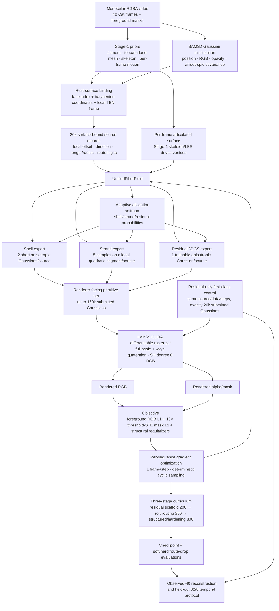
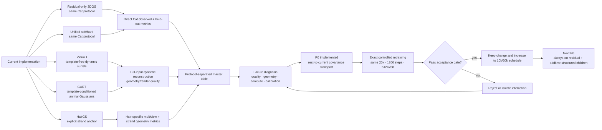

# Current unified fur/hair reconstruction pipeline and contribution map

Date: 2026-08-10 (updated after covariance-transport ablation)

## 1. End-to-end optimization pipeline

### What happens to one source point

For source (i), Stage-1 provides a surface face and barycentric root.  The
current triangle produces a tangent/bitangent/normal frame.  All learnable
offsets and directions are stored locally, then mapped to the current frame:

- the shell branch emits two samples along a short learned direction;
- the strand branch emits five oriented samples along a quadratic segment;
- the residual branch emits one ordinary anisotropic 3D Gaussian;
- a three-way softmax divides the source opacity among these branches.

With the default 2/5/1 samples, 20k sources become 160k submitted primitives in
the unified path.  The residual-only path is compact and submits exactly 20k.
Soft/hard unified evaluation currently does not compact zero-opacity branches.

## 2. Optimization and evaluation loop

The table must keep three evidence levels separate:

1. **Direct** — identical Cat data, prior, point budget, step budget, renderer
   and metric.  Residual-only versus unified belongs here.
2. **Anchor** — an official/intended but different dataset.  HairGS wCurly
   belongs here and its PSNR must not be ranked against Cat.
3. **Readiness/blocked** — software and data are prepared but a valid fit has
   not completed.  GART remains here until the licensed D-SMAL/BITE body assets
   are supplied.

## 3. Current core contributions

### C1 — Optimization-first unification, not a feed-forward reconstructor

The representation is optimized per video through differentiable rendering.
It does not depend on a large network producing all Gaussians in one forward
pass.  This preserves the controllability and convergence diagnostics of
traditional 3DGS inverse rendering while allowing fiber-specific structure.

### C2 — One surface-local parameterization for articulated fur and hair

Every source is bound to the Stage-1 animal surface and driven by its per-frame
motion.  Local offset, orientation, covariance, length and curvature therefore
move with the body rather than being independently re-estimated in every frame.
The residual center and anisotropic covariance now use the same rest-to-current
surface-frame transport.  The same interface can express short dense fur, long
thin hair and an appearance-residual Gaussian fallback.

### C3 — Differentiable adaptive shell/strand/residual allocation

Each surface location learns a soft allocation over three geometric experts.
The scaffold → soft routing → structured curriculum makes representation choice
end-to-end differentiable and permits route-drop/contribution audits.  Current
route values are correctly interpreted as *allocation weights*, not calibrated
epistemic confidence.

### C4 — A mandatory residual-only method and controlled falsification protocol

Residual-only is implemented as a compact first-class reconstruction method,
not a weak ablation.  It has the same initialization, motion, renderer, data,
source count and training budget as the unified model.  This exposed the key
fact that adding seven children per source currently hurts observed-frame fit,
so nominal primitive count is not the bottleneck.

### C5 — Cross-regime benchmarking without invalid metric mixing

The project now separates Cat observed reconstruction, skeleton-conditioned
temporal extrapolation, template-free dynamic reconstruction, fur-specific
geometry and explicit-hair geometry.  Vidu4D, GART and HairGS test different
failure modes instead of being forced into one misleading PSNR ranking.

### C6 — Contribution/risk audit as part of the representation

Soft/hard routing, leave-one-route-out rendering, route mass, spatial agreement,
training curves and submitted primitive count are recorded together.  This is
needed to decide whether a branch adds genuine held-out value or only consumes
opacity/compute.

## 4. What is not yet a contribution claim

The current code must not yet be described as a completed universal
shell/explicit-strand/volumetric representation:

- `residual` is a surface-bound 3D Gaussian, not a true narrow-band volume;
- the three experts share RGB and base opacity;
- five isolated strand samples are not connected long-hair topology;
- residual covariance transport is implemented and rigid-rotation tested, but
  the triangle frame is still defined by its first edge rather than a stable
  polar-decomposition deformation gradient;
- appearance is degree-0 RGB, without view-dependent fiber highlights;
- there is no densification/pruning and source selection follows PLY order;
- 1,200 steps provide only about 30 updates per frame for a 40-frame sequence.

## 5. Covariance transport: implemented result

The residual center is evaluated as

`root_current + TBN_current * local_offset`,

but its anisotropic covariance quaternion is emitted directly.  When an animal
limb or torso rotates, the Gaussian center follows the body while its long axis
can remain in its old world direction.  This violates the surface-bound model
before any question of loss design, routing or network capacity arises.

The implemented correction is

`R_gaussian_current = R_face_current * R_face_rest^T * R_gaussian_rest`.

It changes neither source count, raster budget nor loss.  All 20k/1,200-step
controlled runs completed and the full test suite passes (20/20).  Unified-soft
improved by +0.0606 dB on observed frames and +0.0216 dB on held-out frames;
unified-hard improved by +0.0841 dB and +0.0755 dB respectively.  Residual-only
showed a small metric trade-off: -0.0457 dB/+0.00104 IoU observed and
+0.0582 dB/-0.00428 IoU held-out.  The correction is kept as a geometric
correctness invariant, but its modest effect confirms that the next material
change should be always-on residual Gaussians with additive shell/strand
children rather than further tuning the exclusive gate.
