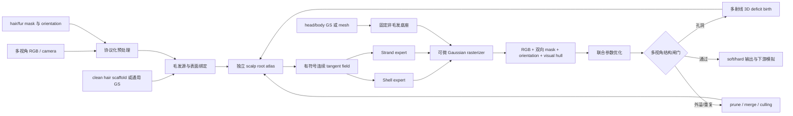

# UniFur 当前算法框架、评估协议与第三方进展评审

> 评审日期：2026-08-20 
> 评审对象：UniFur 的 Fur/Hair 统一结构化 Gaussian 表示、训练管线和现有 Panda / wCurly 实验 
> 文档性质：基于本机代码、配置、日志、checkpoint、统一评测 JSON 和几何审计的独立复核材料；不是论文结论，也不替代外部匿名评审 
> 结论口径：严格区分“设计目标”“代码已实现”“实验已验证”和“尚未解决”

## 1. 执行摘要

UniFur 的合理研究目标不是让一个无约束的 residual 3DGS 在所有图像指标上都输给结构化分支，而是把已重建的毛发外观迁移到具有明确物理归属的 `shell + strand` Gaussian 表示，使短密 fur、长发 hair 及其混合区域能够在同一可微渲染器中自适应分配，并支持后续编辑、碰撞、风场和动力学模拟。

当前代码已经形成一条完整的研究原型管线：固定 head/body 底座，建立表面 root atlas 和局部 tangent frame，将每个毛发源分配到 shell / strand 路由，联合优化位置、长度、弯曲、尺度、旋转、opacity、颜色与 route-specific SH，并以 RGB、双向 mask、方向场、visual hull、结构部署和留出视角校准共同训练。Hair 配置中 residual 路由的最终有效质量为 0，但 residual checkpoint 仍作为迁移初始化来源；它不是最终渲染分支。

第三方复核后的核心判断如下。

1. **工程链路成立。** Panda 与 wCurly 都能完成训练、soft/hard 渲染、统一 held-out 评测和底层几何审计；当前测试为 `99 passed, 1 skipped`。
2. **统一结构表示部分成立。** shell、strand、表面 root、方向传播、route-specific appearance/SH 和固定非毛发底座都已进入同一可微优化图，Hair 最终 residual route 为 0。
3. **渲染领先尚未成立。** Panda held-out 上 UniFur v18 soft 为 20.70 dB，低于 Residual-only 的 24.26 dB；wCurly held-out 上 v23 soft 为 16.28 dB，低于 HairGS 的 16.46 dB，轮廓 IoU 也低于 HairGS（0.793 对 0.857）。
4. **Hair 的结构目标尚未成立。** v23 最终有效 route mass 为 shell 75.77%、strand 24.23%、residual 0；活跃 strand tip 的多视角 mask 支持率仅 0.751，近重复 root 比例为 0.279，均未通过当前工程闸门。可视化中的短粗针状毛流、孔洞和外溢同时存在于部分训练与 novel view，不是纯粹的泛化问题。
5. **当前 topology 模块是安全但无效的。** v23 进行了 23 次 topology 事件，共提出 148 个局部 birth；所有候选都因逐视角结构/外溢校准未同时通过而回滚。它成功阻止了点数爆炸，却没有真正创建可填洞的新 3D root。
6. **下一步不是继续调 loss 权重。** 首要工作应是实现可变的 3D root topology：从多个缺口视角的射线交会生成新 root/tip/depth，将新 root 投影到独立 scalp atlas 后再局部优化；不能继续只在已有错误 surface row 或 reserve slot 中切换。

按研究成熟度判断，当前版本属于“**可审计的结构化研究原型 / 关键假设尚未闭环**”，可以支撑方法消融和下一阶段实验；但由于最新代码尚未形成精确提交，目前还不能称为第三方可一键复现版本，也不适合作为“Fur/Hair 统一重建完成”或“SOTA”版本发布。

## 2. 问题定义与论文主张边界

### 2.1 目标任务

输入为静态多视角图像、相机和毛发 mask；可选输入包括表面 mesh、方向图、clean hair scaffold 和 head/body Gaussian 底座。输出不是逐根恢复真实毛发，而是一个与观测等价、可渲染且可编辑的结构化表示：

- 短密、体积性强的 underfur 主要由 shell/fin-like Gaussian 表达；
- 长而连续的头发、鬃毛、guard hair 和 whisker 主要由 strand Gaussian 表达；
- 同一对象的不同区域由可学习路由自适应选择或混合；
- 非毛发 head/body 与毛发结构解耦；
- 输出保留 root、局部 frame、方向、长度、弯曲和 route 归属，可进入下游模拟。

### 2.2 当前可陈述与不可陈述的主张

| 状态 | 可以陈述 | 目前不能陈述 |
|---|---|---|
| 表示 | 在同一 Gaussian renderer 中联合参数化 shell 与 strand，并支持 soft/hard route | 已经学到符合真实毛流的统一 Fur/Hair 分布 |
| 优化 | 结构、外观、mask、方向和 visual hull 可联合反向传播 | 仅靠当前 loss 已解决孔洞、外溢和跨视角一致性 |
| residual | Hair 最终 route 可做到 residual 有效质量为 0 | 完全不依赖 residual teacher；当前仍用其作迁移初始化 |
| 指标 | 有严格 train/held-out 分离和统一 evaluator | 已超过 Residual-only、HairGS 或 NeuralFur 的强基线 |
| 下游 | 输出具备 root/strand/shell 语义，原则上比无归属 GS 更适合编辑和模拟 | 已用量化实验证明下游模拟显著优于 residual 3DGS |

## 3. 一个合理的整体框架

该框架必须同时满足三个闭环：

1. **外观闭环**：训练和 novel view 的 RGB、边缘与感知质量足够接近无约束 GS；
2. **结构闭环**：root、tip、方向、长度、密度和 shell/strand 归属在 3D 中合理，不以图像拟合掩盖几何错误；
3. **应用闭环**：结构化输出在编辑、风场、重力、碰撞和形变传播上比 residual-only 更稳定或更可控。

只完成第一个闭环会退化为普通 3DGS；只完成第二个闭环但图像质量过低则缺少可用性；没有第三个闭环则无法证明统一结构表示的实际价值。

## 4. 当前真实实现

### 4.1 输入、协议与底座

Hair wCurly 当前使用 `hairgs-wcurly-static-train12-test4-v2-camera-fixed`：

- 12 个训练集合视角、4 个完全 held-out novel view；
- 分辨率 1000×1000，相机固定且 train/test 使用同一标定体系；
- 训练内部再将 12 视角拆成 8 个优化视角与 4 个 calibration 视角；
- `hair mask` 只监督头发区域；
- 非头发区域由 HairGS Stage-1 的固定 head/body Gaussian 底座提供，最新审计记录固定底座为 29,315 个 Gaussian；
- 毛发源来自 clean hair-only Stage-1 scaffold，而非将 head/body 一并混入 hair source。

Panda 当前使用 `F-mv-official-prior-28fit-8test-r480-v2`：

- 28 个 fit 视角、8 个官方 held-out 视角；
- 480×270；
- 该结果属于静态多视角 Fur 协议，不能与单目或动态视频结果混排。

### 4.2 初始化与 residual 迁移

当前 Hair 训练并非从随机点完全重建。初始化由三部分组成：

1. 固定 head/body Gaussian 底座；
2. clean hair-only Gaussian scaffold；
3. Residual-only checkpoint 中的颜色、opacity、局部 offset、scale delta 和 rotation，作为外观/几何迁移初值。

迁移时结构化增量为零，soft routes 使用透射率守恒初始化，使迁移前后渲染近似等价。v23 记录的最大平均等价误差为 `1.86e-8`。Hair 的 residual source capacity ceiling 被设为 0，最终 residual route mass 也是 0；因此应准确描述为“**从 residual teacher 迁移到 shell/strand**”，而不是“最终仍由 residual 负责渲染”。

### 4.3 表面 root atlas 与局部 frame

每个毛发源与表面三角形绑定，保存：

- `face_index`；
- 三角形 barycentric 坐标及受限的可学习增量；
- tangent / bitangent / normal 局部 frame；
- scalp occupancy、邻域和多视角可见性支持；
- 方向场置信度与符号同步状态。

当前 atlas 会给 scalp face 分配 root/reserve root，并用表面邻域传播扩展已观测方向。局限是 root 仍受已有 face 和预分配 source row 约束，不能真正跨越错误表面或在缺口射线交会位置创建自由 3D root。

### 4.4 Shell expert

Shell 分支将一个 root 展开为若干短毛 Gaussian，方向由表面 normal 与传播方向混合。其可学习量包括：

- shell 长度和局部方向偏差；
- Gaussian 中心、尺度、旋转和长宽比；
- structured delta / structured opacity；
- route-specific color correction 与高阶 SH；
- shell route probability。

Shell 对短密 fur 合理，也可在 hair 底层承担体积填充，但如果路由将方向困难区域大量转给 shell，会造成 Hair 的短粗针状外观和结构语义退化。

### 4.5 Strand expert

Strand 分支从 root 到 tip 采样多段 Gaussian。当前参数包括：

- 3D 方向与向外符号约束；
- 可学习长度；
- quadratic / cubic bend；
- carrier placement、半径、长宽比和 opacity；
- route-specific color 与二阶 SH；
- strand route probability 和部署强度。

方向场通过多视角 orientation lifting、邻域平行传输和符号同步初始化。最新修复采用 HairGS 的实际方向角约定：图像方向角从 `y` 轴顺时针计量，因此投影切线为 `[sin(theta), cos(theta)]`，而不是先前误用的 `[cos(theta), sin(theta)]`。

### 4.6 渲染和可优化参数

渲染使用 HairGS differentiable rasterizer。RGB/alpha 由固定底座与结构化毛发共同合成；orientation 使用 strand-only 的双角度矩，避免 shell 或 head/body Gaussian 污染方向监督。

| 参数组 | 当前是否优化 | 说明 |
|---|---|---|
| 固定 head/body 的 xyz/scale/rotation/opacity/SH | 否 | 作为干净非毛发底座冻结 |
| Root 的表面 barycentric 坐标 | 是，受限 | 只能在绑定面附近移动，尚不能自由换面 |
| Shell/strand Gaussian 的 xyz | 是 | 由 root、方向、长度、bend 与采样共同决定 |
| Gaussian scale / aspect | 是 | 有 strand aspect 上限，但审计仍发现极端值 |
| Gaussian rotation / orientation | 是 | 与 3D 方向及局部 frame 联动 |
| Opacity / structured deployment | 是 | 决定结构化几何是否真正参与渲染 |
| DC color 与 route-specific appearance | 是 | 包含 expert color correction |
| Route-specific 高阶 SH | 是 | 当前最高二阶，并有限幅正则 |
| Shell/strand route logits | 是 | soft 训练，输出可使用 soft 或 hard route |
| Residual route | Hair 中禁用 | 仅迁移 teacher 参数，最终有效质量为 0 |
| Source 数量与 face_index | 实质上否 | topology 仍复用预分配 slot；这是当前首要缺口 |

因此，当前并非“只优化 GS 位置和归属”。它已经优化主要渲染表征参数；真正缺失的是可变 topology 与能跨面创建新 root 的机制。

### 4.7 损失函数

当前 loss 可分为六组。

1. **外观**：foreground RGB/L1、颜色梯度、route-specific appearance/SH 正则。
2. **双向 mask**：soft/binary mask、前景 coverage、背景 spill、boundary、balanced mask；既惩罚 mask 外有点，也惩罚 mask 内覆盖不足。
3. **连通结构**：最大连通孔洞的 top-k deficit loss，作为平均 mask loss 的增量项而非替代项。
4. **毛流方向**：strand-only orientation、局部分布、strand alpha coverage、邻域方向一致性、符号投影和平行传输。
5. **3D 可行性**：visual hull、tip mask support、长度上限、向外方向、thinness、bend、root barycentric 和长宽比。
6. **路由与教师约束**：route prior/entropy/neighbor consistency、结构部署、teacher non-regression、逐视角 calibration。

当前问题不是缺少 mask loss，而是二维损失可以由错误深度、过大协方差或 shell mass 迁移补偿。缺少可行的新 3D root 候选时，再强的双向 mask loss 也无法稳定填补 novel-view 空洞。

### 4.8 优化阶段

1. **协议校验与输入拆分**：确认相机、mask、clean hair scaffold 和固定底座。
2. **等价迁移**：加载 residual teacher，以零结构增量初始化 shell/strand。
3. **表面传播**：构建 scalp occupancy、root atlas、邻域图与有符号方向场。
4. **Soft route 联合优化**：优化外观、几何、route 和部署参数。
5. **Structured refinement**：逐步提高结构部署，收紧 visual hull、方向与 route 约束。
6. **Topology event**：从多视角 coherent deficit 选择候选，初始化 root-tip、长度和 bend，只对局部 cluster 短程优化；候选必须同时通过 calibration view 的孔洞、外溢与总损失约束，否则整体回滚。
7. **输出与审计**：导出 soft/hard 渲染、`evaluation.json`、root-tip/scalp PLY、投影图、route mass 与几何质量闸门。

## 5. 已验证实验结果

### 5.1 Panda / Fur：同一 28-fit / 8-held-out 协议

以下均为 480×270、8 个 held-out 视角；数字来自各自的统一 `evaluation.json`。

| 方法 | 适用说明 | FG PSNR ↑ | masked SSIM ↑ | masked LPIPS ↓ | mask IoU ↑ |
|---|---|---:|---:|---:|---:|
| Residual-only 3DGS | 无约束外观上界/teacher | **24.26** | **0.948** | 0.064 | 0.990 |
| UniFur v18 soft | shell/strand，residual=0 | 20.70 | 0.936 | **0.067** | 0.987 |
| UniFur v18 hard | 离散部署 | 19.55 | 0.924 | 0.072 | 0.988 |
| NeuralFur + RGB adapter | 24GB 可运行 adapter，不是完整官方容量 | 18.44 | 0.895 | 0.122 | 0.924 |
| NeuralFur 4k active / 100k candidate | 官方结构目标但 `lambda_dl1=0`，RGB 仅诊断 | 5.23 | 0.832 | 0.209 | 0.870 |

解释：Panda soft 结果可用且 train-to-test gap 较小，但仍比 Residual-only 低 3.56 dB。NeuralFur 原生设置不优化 RGB L1，且本机 24GB 只能运行容量 adapter，因此不能用其低 PSNR 证明 UniFur 在 NeuralFur 原任务上全面领先。Panda v18 最终 route 约为 shell 76.64%、strand 23.36%、residual 0，方向上符合 Fur 以 shell 为主的预期，但“结构更适合下游”尚缺直接应用指标。

### 5.2 wCurly / Hair：同一 12-train / 4-held-out 协议

| 方法/版本 | Split | FG PSNR ↑ | masked SSIM ↑ | masked LPIPS ↓ | mask IoU ↑ | mask MAE ↓ |
|---|---|---:|---:|---:|---:|---:|
| HairGS official | novel 4 | **16.46** | 0.858 | **0.125** | **0.857** | 0.0370 |
| Residual-only v11 | train 12 | 20.32 | 0.913 | 0.097 | 0.943 | 0.0104 |
| Residual-only v11 | novel 4 | 15.93 | 0.858 | 0.159 | 0.828 | **0.0336** |
| UniFur v20 soft | train 12 | **20.25** | **0.908** | **0.104** | **0.939** | **0.0109** |
| UniFur v20 soft | novel 4 | 16.23 | **0.861** | 0.158 | 0.817 | 0.0360 |
| UniFur v21 soft | train 12 | 17.06 | 0.888 | 0.127 | 0.841 | 0.0244 |
| UniFur v21 soft | novel 4 | **16.39** | 0.858 | 0.161 | 0.775 | 0.0476 |
| UniFur v22 soft | train 12 | 17.06 | 0.887 | 0.125 | 0.874 | 0.0210 |
| UniFur v22 soft | novel 4 | 15.84 | 0.854 | 0.163 | 0.795 | 0.0424 |
| UniFur v23 soft | train 12 | 17.61 | 0.889 | 0.122 | 0.871 | 0.0212 |
| UniFur v23 soft | novel 4 | 16.28 | 0.856 | 0.159 | 0.793 | 0.0435 |

这些版本不能按编号简单理解为单调改进：

- v20 的训练拟合和轮廓最好，novel mask 也强于 v21-v23；
- v21 的 novel FG PSNR 最高，但轮廓 IoU 和外溢更差；
- v22 增加 tip feasibility 和双向约束后未形成可靠提升；
- v23 修复方向约定与局部 warmup 写回后，比 v22 的 novel PSNR 提高约 0.44 dB，但 IoU、孔洞和外溢没有同步改善；
- HairGS 仍在 novel PSNR、LPIPS 和 IoU 上优于 v23。

最新 v23 hard route 的 train/test FG PSNR 分别为 17.14/15.84 dB，低于 soft route 的 17.61/16.28 dB。当前部署应保留 soft 结果用于渲染评估，hard 结果用于检查离散结构是否稳定，不能只报更好的一个而隐去另一个。

### 5.3 v23 底层几何审计

| 指标 | 数值 | 当前判断 |
|---|---:|---|
| 有效 route mass | shell 0.758 / strand 0.242 / residual 0 | Hair 仍明显 shell-heavy |
| 活跃 source | shell 108,981 / strand 62,910 / residual 0 | 已无 residual route，但不是 strand-major |
| Active Gaussian | 532,512 | 点数多不代表空间覆盖正确 |
| Strand tip 多视角 mask support | 0.751 | 低于 0.85 工程闸门 |
| 近重复 root 比例 | 0.279 | 远高于当前 0.02 启发式闸门 |
| 邻域 axial angle 均值 | 12.77° | 局部无符号连续性尚可 |
| 有符号邻域不一致 | 0.0679 | 通过当前 0.15 闸门 |
| 活跃 strand inward fraction | 0 | 向外符号约束有效 |
| Strand direction-normal cosine 均值 | 0.439 | 比旧版降低，但仍有明显径向分量 |
| Strand 有效部署质量 | 0.769 | 不是“strand 未激活”造成的失败 |
| Strand opacity-weighted 部署 | 0.759 | strand 对渲染确有贡献 |
| 最大有效 aspect ratio | 261.98 | 极端粗长 Gaussian 仍存在；p99 约 50 |
| Topology 事件 | 23 次，148 candidates，0 accepted | 安全回滚有效，真实填洞无效 |

几何审计状态为 `structurally_unresolved`，失败项是 `near_duplicate_root_fraction` 和 `multiview_active_tip_mask_support`。这些闸门是工程启发式指标，应与图像指标并列报告，不应替代正式 benchmark。

## 6. 三个独立评审视角

### 6.1 方法评审人：表示与新颖性

**评分：3.0 / 5，结论：有论文潜力，但核心结构假设未闭环。**

优点是问题定义清晰：用 shell 处理体积性短毛，用 strand 处理连续长毛，并将 route、外观和几何统一到 Gaussian renderer。相比单纯 residual 3DGS，输出具有更明确的 root 和模拟语义。缺点是当前 Hair 路由会把困难区域转移给 shell，导致形式上统一、功能上却未形成 strand-dominant hair；topology 也没有真正改变 root 集合。

方法成立的最低条件不是 PSNR 必须超过 residual，而是：在可接受的外观差距内，Hair 的 strand route 形成连续、可编辑、可模拟的主结构，Fur 的 shell route 形成稳定体积层，并通过相同下游任务证明结构优势。当前只满足前半部分的接口设计。

### 6.2 实验与复现评审人：证据完整性

**评分：3.0 / 5，结论：协议与审计较强，版本可追溯性仍有硬缺口。**

优点包括固定 protocol id、明确 split/resolution/camera、统一 evaluator、soft/hard 双报告、训练和 novel view 分开、底层 PLY/geometry audit 以及 topology event 全量记录。当前全测试通过 `99 passed, 1 skipped`。

硬缺口是最新 v23 实验代码没有对应可获取的精确 Git commit。实验工作树基于本地 `7865edb`，远端 `origin/main` 为 `8483a9d`；另有 4 个修改文件和 2 个未跟踪配置/脚本。工作树 binary diff 的 SHA-256 为 `cb61242e...a0f4ce`，但 diff hash 不能替代正式 commit。第三方目前能审查结果，不能只靠远端仓库一键复现 v23。

### 6.3 应用评审人：编辑与模拟价值

**评分：1.5 / 5，结论：表示接口有价值，应用证据不足。**

root、tip、长度、弯曲、局部 frame 和 route 归属理论上可以直接驱动风场、重力、碰撞、梳理和局部长度编辑，这是 residual-only 无归属点云不具备的优势。但当前重复 root、tip 支持不足和 shell-heavy Hair 会导致力传播不连续、局部编辑泄漏和碰撞不稳定。现有视频主要证明“可以驱动”，尚未量化证明“比 residual 下游更好”。

建议将下游实验从附加演示升级为主评价轴，而不是等渲染指标完全追平后才测试。

### 6.4 综合判断

| 维度 | 评级 | 判断 |
|---|---|---|
| 研究问题与潜在贡献 | B+ | 统一结构化 Fur/Hair 表示有明确学术价值 |
| 实现完整度 | B | 训练、渲染、评测、审计链路完整 |
| Fur 结果 | B- | 可用但仍低于 residual 外观上界 |
| Hair 结果 | C | 毛流、孔洞、外溢和 route 语义未解决 |
| 复现性 | C+ | 产物证据充分，最新代码未形成精确 commit |
| 下游应用验证 | D+ | 只有可行性，缺少对照和量化 |
| 当前论文状态 | Weak Reject / Major Revision | 方法值得继续，但核心实验尚不足 |

## 7. 当前问题的根因排序

### P0：预分配 surface root 不是可变 3D topology

当前 topology 候选仍来自已有 source/reserve row，root 只能在原 face 的 barycentric 邻域移动。若初始 scaffold 在孔洞区域没有正确深度或 face 归属，局部优化无法跨面创建正确 3D 毛发。23 次全部回滚说明问题不是“事件太少”，而是候选空间中缺少可同时改善多个视角的解。

### P0：Hair 路由存在结构逃逸

方向、tip 或 strand mask 约束难优化时，将质量迁移到 shell 往往能降低短期 RGB/mask loss。结果是 residual 虽然为 0，Hair 却仍是 shell 75.8%。这满足“无 residual”，但不满足“Hair 的主要可模拟结构由 strand 承担”。

### P0：Root 重复与覆盖同时存在

root 数量很多，但近重复率 0.279，说明点预算堆积在已有区域；novel view 仍出现大孔洞，说明“数量不足”不是主要问题，“空间分布与深度不正确”才是。简单增加 Gaussian 数量可能继续加剧局部过亮和粗大发尾。

### P1：方向监督仍可能被协方差外观替代

修正图像方向角约定后，径向性有所下降，但 strand 仍短、粗、交叉。二维 orientation 可以通过 Gaussian covariance 的主轴获得较低损失，却不保证 root-to-tip 曲线在 3D 中形成与 GT 一致的长程有符号毛流。

### P1：尺度和 opacity 有局部病态解

有效 Gaussian aspect ratio 最大值约 262，超过配置中的 strand 目标上限。这类极端点会在某些视角填洞，在另一些视角形成外溢、过亮边缘或粗大发尾。应按 route 分别审计 scale、opacity 和 screen-space footprint，而非只看全局正则均值。

### P1：优化目标与最终结构目标不完全一致

现有 non-regression 和平均 calibration 偏向保留 teacher 外观；birth 又要求多视角同时不退化。在错误 teacher/scaffold 上，这两个机制会形成保守局部最优：不爆炸，也不允许必要的结构重排。

## 8. 修改路线与可证伪实验

### 8.1 第一优先级：真正的 3D deficit densification

需要替换 Hair topology 的核心生成逻辑，而不是增加更多 reserve source。

1. 在每个 calibration view 提取最大连通 false-negative 区域，而非只使用平均 deficit。
2. 从至少 3 个一致缺口视角发射带相机标定的 ray，联合求解 root/tip/depth；使用重投影 mask、方向角和 scalp 邻域作为评分。
3. 将候选 root 投影到独立 scalp atlas 的最近合法位置，并允许重新指定 `face_index`、barycentric/scalp UV；tip 保持为真正 3D 变量。
4. 从邻域有符号方向场初始化长度与曲率，从相邻可见毛发初始化 SH/opacity/scale。
5. 动态 append 新 source，或使用未绑定的空 slot；不能复用已经绑定到错误 face 的 row。
6. 只优化 birth cluster 及其一环邻域，随后逐视角检查：最大孔洞必须下降，外溢不得上升超过阈值，至少两个 novel proxy/calibration view 获得正贡献。

**证伪条件**：如果真正新建 3D root 后仍有 90% 以上事件被回滚，且候选重投影在缺口视角也不能改善 mask，则 scalp 几何/相机/mask 协议本身有系统性错误，应停止优化 route loss 并回查数据。

### 8.2 第二优先级：防止 Hair strand collapse

- 在 tip support、方向一致性和 root coverage 未达闸门前冻结或限制 shell/strand route mass；
- 禁止把 orientation 不可解区域自动转给 shell；
- 以 `leave-one-route-out` 的正贡献更新 route，只奖励移除该 route 后性能变差的有效质量；
- 对 Hair 设置功能性 strand 下限，但下限应作用在 opacity-weighted deployed contribution，而不是名义 logits；
- 对 Fur 使用相反但非硬编码的先验：shell-major 只是弱先验，guard hair/whisker 仍可由 strand 接管。

**证伪条件**：如果 strand contribution 提升后 novel mask/方向和下游编辑都不改善，只是 PSNR 下降，则当前 strand parameterization 本身不足，而不是路由权重问题。

### 8.3 第三优先级：Root atlas 的覆盖—去重联合优化

- 在 scalp geodesic 距离上做 Poisson/blue-noise coverage；
- 对近重复 root 执行 merge 或排斥，不按欧氏距离跨 scalp 层错误合并；
- 用每个 atlas cell 的多视角可见 deficit 建立 birth priority；
- 把 root coverage、tip coverage 和方向 field coverage 分开记录；
- 允许 root 跨 face 迁移，但必须保持 scalp UV 连续和 collision-safe。

### 8.4 第四优先级：方向和尺度的结构监督

- 在 scalp 上学习有符号连续 tangent field，而不是逐点独立 3D direction；
- 监督整段 strand 的多视角投影曲线与方向，不只监督局部 Gaussian covariance；
- 加入长度分段和曲率频谱先验，避免短针与高频折线；
- route-specific 限制 world-space scale、screen-space footprint 和 opacity-scale product；
- 对超过上限的病态 Gaussian 显式 split/merge，而非仅靠软正则。

### 8.5 第五优先级：把下游应用变成正式评价

至少建立三个对照任务：

1. **局部梳理/长度编辑**：记录目标区位移、非目标区泄漏、根部滑动和多视角一致性；
2. **风场/重力模拟**：比较 root 固定误差、曲线连续性、碰撞穿透率、帧间闪烁；
3. **头部形变或姿态变化**：比较毛发与 scalp 的附着误差、体积保持和 novel-view 质量。

Residual-only 应作为外观上界和“不具备原生结构”的对照，而不是强行把每个 residual 点映射成伪 strand 后再宣称可模拟。

## 9. 统一评估策略

### 9.1 协议隔离

以下结果必须分表，禁止混排：

- Fur 与 Hair；
- 静态多视角、动态多视角和单目；
- training view 与 held-out novel view；
- 原生论文配置与显存 adapter；
- soft route 与 hard route；
- 固定相机与重新估计相机。

进入同一数值表的最小条件是：相同数据、相同 split、相同分辨率、相同 camera、相同 foreground/mask 定义，并由同一版本 `scripts/evaluate_external_renders.py` 生成 `evaluation.json`。

### 9.2 八个评价维度

| 维度 | 必报指标 | 目的 |
|---|---|---|
| A. 协议完整性 | dataset/split/resolution/camera/mask/evaluator hash | 防止不可比结果混排 |
| B. 图像外观 | FG PSNR/L1、masked/full PSNR、SSIM、LPIPS | 衡量重建与感知质量 |
| C. 轮廓拓扑 | IoU/F1/MAE、background opacity、FN/FP、最大连通 FN/FP | 同时衡量孔洞和外溢 |
| D. 3D 毛发结构 | root coverage/重复率、tip support、长度、bend、方向、aspect | 防止二维指标掩盖错误几何 |
| E. 表示分配 | soft/hard route mass、active source、deployed mass、LOO contribution | 判断 shell/strand 是否真正工作 |
| F. 跨视角泛化 | train-test gap、最差视角、leave-one-view-out 风险 | 避免平均值掩盖坏视角 |
| G. 下游应用 | 编辑泄漏、root 滑动、碰撞穿透、时序稳定 | 验证结构化表示的核心价值 |
| H. 工程复现 | commit、配置、seed、显存、时长、checkpoint/hash、测试 | 支撑第三方复核 |

### 9.3 建议阶段闸门

闸门是工程决策条件，不应包装成论文标准。

| Gate | 建议通过条件 | 当前状态 |
|---|---|---|
| G0 复现 | 精确 commit + clean worktree + config/seed/artifact hash | **未通过**：v23 无正式 commit |
| G1 训练拟合 | Hair train FG PSNR ≥ 20、IoU ≥ 0.93，最大孔洞/外溢不劣于 v20 | **未通过**：v23 为 17.61 / 0.871 |
| G2 几何结构 | residual=0；tip support ≥ 0.85；重复 root 显著下降；Hair strand 为主要功能贡献 | **未通过** |
| G3 Novel view | 至少不低于 HairGS 的 PSNR/LPIPS/IoU，最差 FN/FP 同时改善 | **未通过** |
| G4 下游 | 至少两项编辑/模拟指标显著优于 residual-only | **未评估** |
| G5 统一性 | Panda/Fur 与 Hair 各至少 2 个 case 达到 G1-G4 | **未评估** |

## 10. 下一轮最小实验矩阵

| 实验 | 唯一变量 | 必看输出 | 通过标准 |
|---|---|---|---|
| E1 动态 3D birth smoke | reserve-row → 真正 append/rebind root | root-tip PLY、逐视角重投影、事件 JSON | 至少一个候选在多视角同时降低最大孔洞且不增外溢 |
| E2 Root coverage/merge | 增加 scalp geodesic coverage + duplicate merge | root density map、duplicate fraction | 重复率明显下降且 train/novel IoU 不退化 |
| E3 Strand anti-collapse | 冻结早期 route + positive LOO contribution | route mass、deployed mass、strand-only render | Hair strand 功能贡献上升且 novel orientation/mask 改善 |
| E4 Curve supervision | covariance orientation → full projected curve | GT/预测方向叠图、3D curvature | 针状交叉减少，tip support 上升 |
| E5 Scale pathology | route-specific footprint/opacity-scale gate | aspect/footprint 分布、最差视角 | 极端 aspect 消失，过亮/粗大发尾减少 |
| E6 下游应用 | UniFur vs residual-only | 编辑/模拟视频与量化 JSON | UniFur 在结构稳定性上有明确优势 |

每次只改变一个核心机制。E1 未通过前，不建议继续长跑完整 8k 调参；应先在 4 个优化视角 + 4 个 calibration 视角上验证候选几何能产生非零孔洞改善。

## 11. 证据与复核入口

### 11.1 代码状态

- 代码仓：`git@github.com:houguanli/UniFur.git`
- 远端可用主线：`8483a9d` (`Add support-aware structural hair migration`)
- 最新实验本地基线：`7865edb`，本地相对远端 ahead 1；该提交不应被当作有效公开里程碑
- v23 工作树修改：`config.py`、`fiber_optimize.py`、`hairgs_renderer.py`、`test_unified_fiber.py`
- v23 未跟踪入口：`configs/fiber_hairgs_wcurly_flowfixed_v23_8k.yaml`、`scripts/run_unifur_wcurly_v23.sh`
- 工作树 diff SHA-256：`cb61242e9d31811c0a8823424989fc508ab9e7bba3564db263381b2fa3a0f4ce`
- 全测试：`99 passed, 1 skipped`（2026-08-20 本机复核）

### 11.2 wCurly v23 产物

- Run：`F:\fur_hair_unified_data\benchmarks\hairgs_wcurly_static_results\cleanhair_v23_flowfixed_viewfraction_8k_v10`
- Checkpoint SHA-256：`D67CFCC7F3C0A3EC19DF8F958D4B361678A26F0F3EB7E8F6D6CF9A27945967A8`
- Geometry audit SHA-256：`2C6502C10D24849A2D52C6A08BDA21D04EFD533612CD217903F0CA042E998206`
- Soft train：`..._eval_soft_train\external_evaluation\evaluation.json`
- Soft novel：`..._eval_soft_test\external_evaluation\evaluation.json`
- Hard train/novel：对应 `..._eval_hard_{train,test}`
- 几何：`geometry_audit\geometry_audit.json`、`shell_root_tip.ply`、`strand_root_tip.ply`、`scalp_occupancy.ply`
- Topology：`topology_events.jsonl`

### 11.3 Panda v18 产物

- Run：`F:\fur_hair_unified_data\benchmarks\neuralfur_panda_shared\full_unified_routesh_v18_12k`
- Soft train/test：`eval_full_unified_routesh_v18_12k_soft_{train_v28,test_v8}\external_evaluation\evaluation.json`
- Residual-only：`eval_residual_balanced_v28_20k_r480_strict\external_evaluation\evaluation.json`
- NeuralFur adapter：`neuralfur_4k_rgb_l1_appearance_ft5000\heldout_v8_evaluation_r480_bodygs_15k\evaluation.json`

外部 workspace 保存大体积 checkpoint、渲染和 PLY；Git 仓库只保存路径、摘要和校验信息。

## 12. 第三方复核清单

第三方在接受任何 UniFur 结论前，应完成以下检查。

- [ ] 从明确 commit 建立 clean environment，而不是复用当前未提交工作树。
- [ ] 校验 dataset、camera manifest、mask、resolution 和 evaluator 版本。
- [ ] 同时查看 train/novel、soft/hard、RGB/mask 和 root-tip/scalp PLY。
- [ ] 复算 evaluation JSON，随机抽查 per-frame GT/prediction 对齐。
- [ ] 检查 route mass 是否是 opacity-weighted deployed contribution，而不只是 logits。
- [ ] 检查 Hair 的 strand-only render 是否形成连续毛流；不能只看混合结果。
- [ ] 检查 topology candidate 是否创建新 3D root，还是仅复用已有 row。
- [ ] 对最大孔洞和最大外溢视角单独做失败分析。
- [ ] 在至少一个编辑和一个模拟任务上与 residual-only 对照。
- [ ] 对 Panda 与 Hair 分开形成结果表，再讨论统一性。

## 13. 最终判断

UniFur 的研究方向是合理的：渲染指标允许略低于 residual-only，但必须换来可验证的结构化归属和下游价值。当前代码已经跨过“概念原型”阶段，拥有完整的联合优化、评测和诊断基础；Panda 证明 shell-major Fur 可以稳定工作，Hair 也证明 residual 可被迁移到 shell/strand 并保持可渲染。

但最新 Hair 实验尚未解决决定论文成败的核心问题：strand root 的 3D 分布、连续毛流、孔洞/外溢的联合控制，以及结构化输出对下游任务的真实优势。当前最有价值的发现不是某个 PSNR 小幅变化，而是通过 topology 日志和几何审计确认：**固定 surface scaffold 中不存在足够的可行候选，二维 loss 无法替代真正的 3D root birth。**

下一阶段应以“动态 3D root topology 能否产生第一个被多视角接受的 birth”为单一首要里程碑。该里程碑通过后，再恢复完整 8k 训练、扩大 Hair case，并进入下游应用对照；在此之前不应继续把参数微调结果标记为新的方法里程碑。
